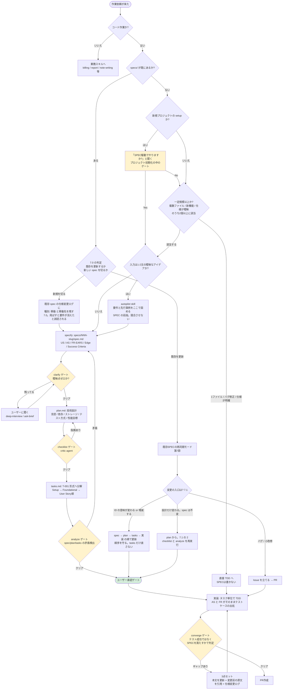

# SPEC駆動開発 (/spec-driven)

## 1. なぜやるか

`/vibe` は Plan から Ship までのパイプラインを持っているが、Plan の入力である
「何を作るか / なぜ作るか」が構造化されていない。planner agent に自然文で渡している。
その結果、次の3つが毎回起きる。

- 受入基準が言語化されないまま実装が始まる。「動いた」の判定がテスト成功に置き換わる
- 実装中の発見が仕様に戻らない。次のセッションで前提を再構築する羽目になる
- 「速い」「適切に処理する」といった曖昧な要求が、AI の解釈で勝手に確定される

この skill が解くのはこの3つだけ。フローの段数を増やすことが目的ではない。

## 2. 発火条件と分岐



黄色 = 品質ゲート、緑 = 人間の承認ゲート。

**置き場は `specs/<NNN>-<slug>/`。** リポジトリ直下、3桁連番プレフィックス、`docs/` の下ではない。
連番はブランチ名 `feat/001-side-preview-translation` と一致させる。名前だけでブランチと spec が対応する。
`docs/plan/<verb>-<topic>.md` (planner 規約) とは物理的に別階層なので、"plan.md" の意味が衝突しない。

## 3. 9工程と担当

**新規に作るのは specify と tasks の2つだけ。残り7工程は既存資産の再配線。**
フローを丸ごと新設しない (ETHOS「Search before building」)。

| 工程 | 責務 | 誰がやるか |
|---|---|---|
| constitution | プロジェクト全体の原則・制約を固定 | `CLAUDE.md` + `~/.claude/rules/*.md` が既に担っている。**新設しない** |
| specify | WHAT/WHY を仕様化 | **この skill** (`references/spec-template.md`) |
| clarify (ゲート) | 曖昧点を洗い出して確定 | `deep-interview` skill + `ask-brief` skill |
| plan | HOW (技術設計) へ変換 | `planner` agent (`references/plan-template.md` の骨組みを渡す) |
| checklist (ゲート) | 成果物が満たすべき観点の抜けを確認 | `critic` agent |
| tasks | 実装可能な単位へ分解 | **この skill** (`references/tasks-template.md`) |
| analyze (ゲート) | spec / plan / tasks 間の矛盾検出 | `critic` agent または `codex-converge` skill |
| implement | 実装 | `tdd-guide` agent + `executor` agent |
| converge (ゲート) | コードと仕様のギャップ確認 | `verifier` agent / `/verify` |

## 4. 手順

各 Step は**宣言してから始める**。宣言しない Step は実行したことにならない。

### Step 0: 発火を宣言する

宣言文: 「spec-driven skill を使う。対象: `specs/<NNN>-<slug>/`」

`<NNN>` は既存 `specs/` の最大値 +1。ディレクトリが1つも無ければ `001`。
同時にブランチ名を `feat/<NNN>-<slug>` で切る。

**採番したら直ちに `mkdir specs/<NNN>-<slug>/` で予約する。spec.md を書き終わるまで待たない。**
実測 2026-08-17: 採番から spec.md 完成までの2時間のあいだに、別セッションが同じ 003 を取った。

### Step 1: specify

宣言文: 「specify: `specs/<NNN>-<slug>/spec.md` を書く。技術名は書かない」

`references/spec-template.md` をコピーして埋める。空欄を残さない。
判断できない項目は `[要確認: ...]` を残し、Step 2 で潰す。推測で埋めない。
書き終えたら frontmatter を `status: active` (承認待ち) に動かす。`backlog` のままにしない。

### Step 2: clarify ゲート

宣言文: 「clarify: 未確定 N 件をユーザーに確認する」

`[要確認:` を grep して残数を数える。0でなければ `ask-brief` 形式で最大4問ずつバッチして聞く。
0になるまで Step 3 に進まない。**ゼロ件を grep で示せないうちは、このゲートは通っていない。**

`[要確認:` が0件でも、**数値境界は毎回この定型で確認する。「以上 / 以下 / 超える / 未満」のどれか、元の文言と突き合わせたか。**
EARS は文型を強制するが、不等号の向きは守らない。実測 2026-08-17: 原文の「10k 以上」が変換で「超える」に反転し、
境界ちょうどの挙動が逆になった仕様がドラフトのまま通りかけた。

### Step 3: plan

宣言文: 「plan: planner agent に委譲する。入力は spec.md と `references/plan-template.md`」

技術選定、アーキテクチャ、データフロー、テスト戦略、リスク表 (R-N)、未決事項表 (Q-N)、
末尾の Self-Critic 6項目まで書かせる。

### Step 4: checklist ゲート

宣言文: 「checklist: critic agent に plan.md を読ませる」

指摘が出たら plan.md を直す。spec.md は触らない。

### Step 5: tasks

宣言文: 「tasks: `T-001` から採番する。スコープはこの spec ディレクトリ単位」

`references/tasks-template.md` をコピーして埋める。
Setup → Foundational → User Story の順。test タスクを対応する impl タスクの直前に必ず置く。

冒頭の `## タスク一覧` 表に全 T を1行ずつ並べる。列は `T | 状態 | 種別 | difficulty | 依存 | トレーサビリティ`。
**機械可読な項目はこの表が唯一のソース。** `### T-0NN` ブロックには散文 (`内容` / `完了条件` / `リスク`) だけ残し、
状態や依存を二重に書かない。2箇所に書けば必ず片方が腐る。
状態の値は `未着手` / `進行中` / `完了 (YYYY-MM-DD)` / `廃止 (YYYY-MM-DD)` の4つだけ。
末尾の `## 並列実行できる組み合わせ` も空欄で残さない。
**要件とタスクの対応は一覧表のトレーサビリティ列が唯一のソース。**
末尾の `## トレーサビリティ表` は同じ写像の転置なので、逆引き (要件 → タスク) が要る規模のときだけ足す任意節にする。

### Step 6: analyze ゲート

宣言文: 「analyze: spec / plan / tasks の3ファイルを突き合わせる」

見るのは4点。

1. spec.md の全 ID (US-N / AS-N / FR-00N / SEC-N / SC-N / EC-N / ASM-N) が
   `## タスク一覧` のトレーサビリティ列に1回以上出るか

   ```bash
   grep -ohE '^(\| |### |- \*\*)(US|AS|FR|SEC|SC|EC|ASM)-[0-9]+' spec.md | grep -oE '(US|AS|FR|SEC|SC|EC|ASM)-[0-9]+' | sort -u
   ```

   **Success Criteria / Edge Cases / Assumptions も ID を持つ。** 拾わないと、受入基準そのものが
   どのタスクにも紐づかないまま出荷される

2. tasks.md が参照する R-N / Q-N が plan.md に実在するか。
   **`R-[0-9]+` をそのまま grep すると `FR-002` の後半に当たる。** 前を1文字見て弾く

   ```bash
   comm -13 \
     <(grep -ohE '^\| [RQ]-[0-9]+' plan.md | grep -oE '[RQ]-[0-9]+' | sort -u) \
     <(grep -ohE '(^|[^A-Z])[RQ]-[0-9]+' tasks.md | grep -oE '[RQ]-[0-9]+' | sort -u)
   ```

   実測 2026-08-17: 語境界を入れないと FR-001〜FR-007 が R-001〜R-007 として7件誤検出された。入れると0件
3. spec.md の「含まない (次イテレーション)」に入れた ID を、tasks.md が拾ってしまっていないか
4. 仕様変更ログの `影響 ID` に出る全 ID が、トレーサビリティ列にも出るか
   (種別が「廃止」の ID は、担当タスクの状態が `廃止 (YYYY-MM-DD)` になっていること)

1つでも外れたら Step 1 に戻る。

### Step 7: ユーザー承認ゲート

3ファイルを提示して承認を得る。**承認前に実装を始めない。**
3ファイルは1コミットで同時に追加する (実績どおり)。ゲートは commit ではなく承認で効かせる。

承認を得たら、spec.md の frontmatter を `status: in-progress` に動かす。
**この1行が規則4の発火点。** ここから先、spec.md の本文は3点セットなしに触れない。

**同じ操作で plan.md の `Status` も `approved (<承認日>)` に動かす。** 承認までは `draft` のまま。
動かすのはこの承認時の1回だけ。2つの状態軸を別のタイミングで動かすと、どちらが承認済みなのか読み手に判別できなくなる。

### Step 8: implement

宣言文: 「implement: T-0NN から着手する。テストが先」

タスク単位で `tdd-guide` agent と `executor` agent に流す。
`## 並列実行できる組み合わせ` の表に載っている系列は、同じメッセージで並列に起動する
(`~/.claude/rules/model-delegation.md` の Decompose-then-dispatch)。

着手したら `## タスク一覧` 表の状態を `進行中` に、完了したら `完了 (YYYY-MM-DD)` に書き換える。
状態を更新するのは表だけ。`### T-0NN` ブロックの散文は触らない。

### Step 9: converge ゲート

宣言文: 「converge: verifier agent に spec.md の Success Criteria と実装を突き合わせさせる」

**テストが通ったかではなく、spec.md を満たしたかで判定する。**
ギャップが出たら規則4の3点セット (本文を更新 + 変更前の原文を引用 + 仕様変更ログ) をやってから Step 8 に戻る。
verifier が読むのは spec.md の**本文**。本文が古いままなら、verifier は古い仕様に対して合格を出す。

verifier への指示は ID 単位で出す。**「含む」に入れた全 ID (US / AS / FR / SEC / SC / EC / ASM) について、
`VERIFIED` / `PARTIAL` / `MISSING` のどれか + 証拠 (テスト名 / 実行ログの該当行 / コードの位置) を1行ずつ返させる。**
ID 単位にしないと「全体としては満たしている」で丸められ、落ちた1件が見えない。

**全 ID が `VERIFIED` になったら、spec.md の frontmatter を `status: done` に動かす。** ここが終端。
`PARTIAL` / `MISSING` が1つでも残っているあいだは `in-progress` のまま。
`done` にした spec ディレクトリは移動せずその場に残す (穴2)。

## 5. 絶対規則

### 規則1: spec.md に技術名を書かない

言語名、DB名、ライブラリ名、フレームワーク名、API のエンドポイント。全部 plan.md の領分。
spec.md に書いたら plan.md へ移す。例外なし。

WHAT と WHY だけを書く。HOW を1行でも混ぜると、その時点で選択肢が1つに固定され、
plan で技術を比較検討する意味が消える。

### 規則2: すべての FR を EARS 6パターンのいずれかで書く

「速い」「適切に処理する」「使いやすい」を残さない。1つでも残っていたら Step 2 に戻る。
6パターンの早見表は `references/spec-template.md` に埋め込んである。

### 規則3: 実装タスクの前に、必ず対応するテストタスクを完了させる

テストを書く前に実装コードを書いたら、そのコードは消して書き直す。例外なし。
テストタスクの完了条件は「テストが**失敗する**こと (RED)」。
テストが最初から通ってしまう場合、テストが対象を検証できていないので書き直す。
実装タスクの完了条件は「対応するテストが**通る**こと (GREEN)」。

`manual` / `setup` / `spike` 種別と、自動テストを持たない配線層はこの規約の対象外。
対象外にした層は手動チェックリストで担保し、どこを外したかを明記する。
RED 先行の唯一の例外は 7.5 の「現状の挙動を固定するテスト」。それ以外に例外は無い。

### 規則4: spec.md の本文を常に正しく保つ。変更前の原文は必ず辿れるようにする

**発火条件は1点だけ。frontmatter の `status` が `in-progress` に変わった瞬間から。**
`backlog` と `active` のあいだは本文を自由に書き換えてよい (まだ誰も参照していない)。
Step 7 の承認で `in-progress` に動かす。そこから下の規律が始まる。
「着手」「確定」「未着手」のような語を発火条件に使わない。状態を表す語が3種類に増えて誰も判定できなくなる。

**spec.md の本文が唯一の仕様。** テストを書く側も converge の verifier も、本文だけ読めばよい。
仕様変更ログは「なぜそうなったか」の履歴であって、仕様の在り処ではない。

`in-progress` 以降に仕様が変わったら、**必ず3点セットで**行う。

1. **本文を新しい内容に更新する**
2. **該当箇所の直下に引用ブロックで変更前の原文と変更日を残す**
   ```markdown
   > 変更前 (2026-08-17): 翻訳結果はサイドパネルに表示する
   ```
3. **`## 仕様変更ログ` に日付見出しでエントリを追加する**

**1つでも欠けたら未完了。** 実装に進まない。

- 1 だけやって 2 と 3 を飛ばす → 「なぜこの仕様になったか」が消える。
  `git log` を掘れば分かるという反論は、3か月後の自分がそれをやらないので成立しない
- 3 だけやって 1 を飛ばす → **本文が嘘になる。** これが実際に起きている。
  `repo-B/specs/002-remote-mcp-and-cloudflare/spec.md` は26行目と80行目で「US-2 を含む」と言い、
  89行目で「US-2 は延期」と言う。同じファイルの中で。本文から読み始めた人は間違ったスコープを信じて実装する

ログのエントリには、次の**2行を機械可読な形で必ず置く**。

```markdown
**影響 ID**: FR-003, AS-2      ← カンマ区切り。無ければ「なし」
**種別**: 追加 | 訂正 | 廃止 | 移動   ← 1つだけ選ぶ
```

この2行があるから、analyze ゲート (Step 6 の4点目) が `grep` で変更済み ID を機械的に列挙できる。

残りは散文で4点。**変更前** / **変更後** / **理由** (実測根拠 / ユーザー判断 / 外部制約のどれか) /
**この変更で増えた約束、または減った約束**。
約束の増減を書かないエントリは、読んでも実装が何を足すべきか / 何を消すべきかが分からない。

## 6. 実績で露呈した3つの穴と、その潰し方

2リポジトリの運用で実際に起きた失敗。放置すると必ずもう一度起きる。

### 穴1: T番号の採番スコープが未定義

`repo-A` の 002 が `T-101` から採番を始めている。
「spec 単位で独立採番」か「リポジトリ通し」かを決めていなかったため、後から衝突を避けた形跡。

**潰し方: T番号は spec ディレクトリ単位で `T-001` から。** リポジトリ通しにしない。
spec が違えば同じ `T-001` が存在してよい。参照するときは `002/T-001` と書く。

### 穴2: ブロック状態の spec の置き場が未定義

`repo-A` の 002 は「環境許可待ち」で Phase 1 以降が未着手のまま `specs/002-.../` に残っている。
ディレクトリを見ても、生きているのか死んでいるのか分からない。

**潰し方: spec.md の frontmatter に `status` を持たせ、planner 規約の lifecycle をそのまま流用する。**

```yaml
---
status: in-progress   # backlog | active | in-progress | done
branch: feat/001-side-preview-translation
---
```

`backlog` → `active` → `in-progress` → `done`。**新しい lifecycle を発明しない。**
「blocked」「shipped」「rejected」のような status を勝手に足さない。

4値の意味。`backlog` = spec.md をまだ書いていない、またはブロック中。
`active` = specify を書き終えて Step 7 の承認待ち。`in-progress` = 承認済みで実装中 (規則4の発火点)。
`done` = Step 9 の converge ゲートを通過。
`/vibe` が拾うのは `active` と `backlog` の2つで、`active` が優先される (`~/.claude/commands/vibe.md:100`)。
ブロック中は `status: backlog` に戻し、理由を `## 着手の前提` 節に書く。
`done` になった spec ディレクトリは移動せずその場に残す (連番とブランチ名の対応が壊れるため)。

**ブロックが解けて再開するとき、前提にしている spec が動いていないかを必ず確認する。**

```bash
git log --since=<自 spec の作成日> --oneline -- specs/<前提NNN>-*/spec.md
```

出力が空でなければ、前提 spec の仕様変更ログを読み、自分の spec.md に「種別: 訂正」で取り込むか、
7.0 の判定をやり直す。止まっているあいだに足元が動いている、が普通に起きる。
実績: `repo-A` の 002 は 001 への依存を宣言していて (`002/spec.md:4`)、
その 001 は 002 が作られたのと同じ日に仕様変更している (該当コミットは 001 の `git log` で辿れる)。

### 穴3: 実測ログの命名が自由

`docs/model-eval.md` / `cli-bridge-eval.md` / `spike-brave.md` / `chunk-parallel-eval.md` と揺れている。
spec-kit の `research.md` 相当の成果物なのに、後から探せない。

**潰し方: 実測ログは `docs/<topic>-eval.md` に統一する。**
spike タスクの完了条件には、必ずこのパスを書く。

## 7. 既存 spec の再同期モード

`specs/` が既にあるリポジトリで要件が変わったとき。

### 7.0 既存を更新するか、新しい spec を切るか

先に A と A' を見る。**どちらかに該当したら B〜E を数えない。**

- **A. 対象 spec の frontmatter が `status: done`** ... 常に新規 spec を切る。`done` は終端。戻さない。
  frontmatter が無い spec は、`references/migration.md` の状況3 の 2 と同じ読み方をする (本文の `- ステータス:` / `- 状態:` 行)。
  4値への写像はこれだけ。`確定` / `承認` かつ該当機能が出荷済みなら `done` 相当、`未着手` なら `backlog` 相当。
  **どれにも写らない、または行そのものが無いときは `done` とみなして新規を切る。**
  誤って新規を切るコストは spec ディレクトリ1つ。誤って既存を書き換えるコストは出荷済み spec の破壊で、後者が高い。
  みなしで倒したときは、根拠 (出荷コミット / README の有無) を Step 7 の承認でユーザーに提示する
- **A'. 引き取る対象が、元 spec の「含まない (次イテレーション)」に置かれた ID である** ... 常に新規 spec を切る。
  元 spec は既に閉じた作業単位で、そこに積むと連番とブランチ名の対応が壊れる。
  **B〜E はこのケースを拾えない。** 実測 2026-08-17: 宙に浮いた `repo-A` 001 の FR-003 / FR-004 を
  引き取るケースで B〜E は合計1条件 (C のみ) にしかならず、基準は「既存を更新」と正解の逆を指した

A / A' のどちらにも該当しないときは B〜E を数える。**2つ以上で新規、1つ以下は既存を更新。**

- **B. 廃止される既存 ID (US / AS / FR / SEC) が1つ以上ある** (追加や訂正は数えない)
- **C. 追加される User Story が1つ以上ある** (FR / AS の追加だけなら数えない)
- **D. 変更が触れる ID の数が、spec.md の全 ID の 1/3 を超える**
  分母 (表の行 / `### AS-1` の見出し / `- **US-1 (P1)**:` の箇条書きの3書式をまとめて数え、重複を落とす):
  `grep -ohE '^(\| |### |- \*\*)(US|AS|FR|SEC|SC|EC|ASM)-[0-9]+' spec.md | grep -oE '(US|AS|FR|SEC|SC|EC|ASM)-[0-9]+' | sort -u | wc -l`
  **表の行だけを数えると AS が丸ごと落ちる。** spec-template 自身が AS を `### AS-1` の見出しで書かせるので、
  テンプレに従うほど分母が欠ける。実測 2026-08-17: 旧パターン `^\| (US|AS|FR|SEC)-` は
  `repo-A` 001 で 6 (正: 7)、002 で 0 (正: 14)
- **E. 新しく必要な T の見積もりが、既存 tasks.md の総 T 数の 1/2 を超える**
  分母: `grep -cE '^### T-' tasks.md`

この基準は実績2件を再現する。`repo-A` 002 は US 3本追加 (C) と 46 T vs 001 の 44 T (E) で2条件 → 新規。
001 のクラウドAPI追加は廃止なし / US追加なし / 触れた ID なしで0条件 → 既存更新。

**判定がどちらに転んでも、既存 spec の仕様変更ログに1エントリ残す。**
新規を切った場合は `種別: 移動` と「この論点は `specs/<NNN+1>-<slug>/` へ移した」を書く。
**移動先を書かないと、既存 spec を読んだ人が「この要件は消えた」と誤読する。**
実績: `repo-A` 001 の変更ログは CLI 案を「採らなかった理由」として棄却の形で書いている。
その3時間9分後に同じ CLI の spec 一式 (46タスク) が 002 に作られたのに、001 側にポインタが1文字もない。
001 だけ読むと、話は棄却で終わったように見える。

新規を切ったときは、新 spec.md の冒頭メタに `- 前提となる仕様: specs/<NNN>-<slug>/spec.md`、
新 tasks.md の冒頭に `- **前提となる完成物**: specs/<NNN>-<slug>/ (実装済み | 未着手)` を足す (実績002の形)。

### 7.1 どこまで戻るか

上から順に評価し、**最初に当たったところから始める**。

1. **spec.md の ID (US / AS / FR / SEC) の意味が1つでも変わる、または増減する** → **spec から**。
   規則4の3点セットをやり、plan → tasks → 実装 と降りる
2. **spec.md の ID は1つも動かず、plan.md の節だけが変わる** (設計の作り直し、技術選定の変更) → **plan から**。
   checklist ゲート (Step 4) と analyze ゲート (Step 6) を再実行し、承認ゲート (Step 7) も再実行する。
   **spec.md の仕様変更ログには書かない。** 設計の試行錯誤でログを埋めると、要件の変更履歴が読めなくなる
3. **spec.md も plan.md も動かず、T の分割・順序・並列組み合わせだけが変わる** → **tasks から**
4. 「この変更は 1 でも 2 でもない」と1行で説明できないなら、**それは 1 である**

**要件由来の変更を tasks で吸収するのは禁止。** 順序を破ると、タスクだけが古い仕様を参照した状態になる。
tasks.md のトレーサビリティ列が spec.md に存在しない ID を指している、という形で後から発覚する。
そのときには実装が終わっていて、直すコストが数倍になる。
(3 に該当する純粋なタスク再編は禁止対象ではない)

始点が決まったら、そこから下へ順に降りる。途中を飛ばさない。

- **spec.md**: 規則4の3点セット。本文 + 引用 + 仕様変更ログ
- **plan.md**: 影響する節を更新。Self-Critic の Confidence を実測に合わせて上げ下げする
- **tasks.md**: 新しい T番号を続きから振る。既存タスクの番号は再利用しない
- **実装**: Step 8 へ

バグと小改修は再同期モードに入れない。Issue を立てて PR で処理する (第8節)。

### 7.2 廃止された ID の後始末

仕様変更ログの `種別` が `廃止` のとき、**tasks.md 側の 1 と 2 を必ずいじる** (任意節を置いているなら 3 も)。

1. `## タスク一覧` 表の該当行の状態を `廃止 (YYYY-MM-DD)` にする。**行そのものは消さない**
2. `## 並列実行できる組み合わせ` の表からは、廃止タスクの T番号を**削る。ここだけは削る**
3. 任意節の `## トレーサビリティ表` を置いているときだけ、該当行も消さず担当タスク欄を `廃止 (YYYY-MM-DD)` にする

1 で行を消すと、トレーサビリティ列と依存列が片側だけ壊れる。
2 で残すと、Step 8 が廃止タスクを並列起動する。

既に実装済みだった場合、コードの削除は**別タスクとして新しい T番号で起こす**。
完了条件に「削除後もテストが全件通る」を書く。

**この後始末が一番飛ばされやすい理由**: 廃止 ID がトレーサビリティ列に残っているほうが、
analyze ゲートの「全 ID が列に出るか」検査を通ってしまう。Step 6 の4点目がこの穴を塞ぐ。

### 7.3 既存リポジトリを specs/ へ移す

1問で決める。

```bash
ls -d specs docs/plan docs/specs 2>/dev/null
```

- `specs/` だけ → 移行不要。既に規約どおり
- `docs/plan/` だけ、または `docs/specs/` だけ → **状況1** (1ファイルを3点セットへ割り直す)
- 両方ある → 同じ作業なら **状況3** (片方を畳む)、別の作業なら **状況2** (共存。何もしない)

**対応表・手順・検証コマンドは `references/migration.md`。ここには書かない。**
実測 2026-08-17: `<dev-root>` 配下で両方を持つリポジトリは0件で、状況3 は現時点で該当ゼロ。

## 7.5 現状の挙動が仕様化されていないコードに手を入れるとき

既存コードの振る舞いを変える依頼で、現行仕様が文書に無いとき。
**spec.md を書く前に現状を実測する。** 推測で AS を書くと、直したつもりで壊す。

1. Phase 0 の先頭に `[spike] 現状の挙動を実測する` を置く。完了条件は `docs/<topic>-eval.md` に記録 (穴3の規約)
2. その直後に `[test] 現状の挙動を固定する` を置く。**今の振る舞いに対して通るテスト**を書く。
   規則3の RED 先行に対する唯一の例外で、ここだけ GREEN で始まる。これが変更の安全網になる。
   完了条件は「テストが通り、意図的に壊すと落ちる」
3. spec.md の AS には**変更後の姿だけ**を書く。「現状こうである」は書かない。現状は 1 の実測ログが持つ
4. 規則1 (技術名を書かない) は brownfield でも外さない。現行挙動は画面から観測できる言葉で書く。
   観測できないもの (内部構造、既存クラス名) は plan.md へ

clarify ゲート (Step 2) は「ユーザーに聞いても閉じない項目」が残る。**ユーザーも現状を知らないのが brownfield。**
その項目は「ユーザーに聞く」ではなく「1 の spike で実測して閉じる」に振り替える。
`[要確認: ... → T-00N で実測]` と書き、Phase 0 完了時に未実測ゼロを確認する。

## 8. やらないこと

SPEC を書かないケース。

- 1ファイルで完結する修正
- バグ修正
- 仕様が既に明確な作業 (「この関数に timeout 引数を足す」レベル)

これらは Issue → PR で扱う。SPEC を書くほうが遅くなる。
分岐図の `DIRECT` ノードから直接 TDD に入る。

判断に迷ったら「複数ファイル / 新機能 / 仕様が曖昧」の3条件を数える。**2個以上で SPEC を書く。**

## 9. 参照ファイル

| ファイル | 中身 |
|---|---|
| `references/spec-template.md` | spec.md の雛形。EARS 6パターン早見表と Success Criteria の書き方つき |
| `references/plan-template.md` | plan.md の雛形。リスク表 / 未決事項表 / Self-Critic 6項目 |
| `references/tasks-template.md` | tasks.md の雛形。タスク一覧表 (トレーサビリティ列を含む) / 凡例 / TDD 規約 / 並列実行表 |
| `references/migration.md` | 7.3 の実体。`docs/plan/` からの移行の対応表・手順・検証コマンド |

テンプレート3本は `repo-A` の `specs/001-side-preview-translation/` から写し取ったもの。
節を勝手に足さない。足すときはユーザーに聞く (`~/.claude/rules/directory-conventions.md`)。
